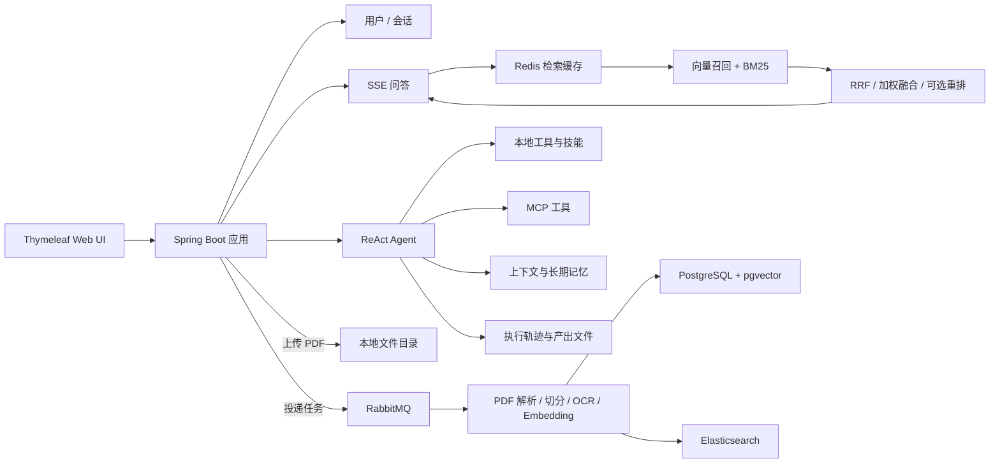

# ChatHelper

基于 Spring Boot 与 Spring AI 构建的私有文档 Agentic RAG 知识服务平台。项目将 PDF 文档处理、混合检索、流式问答、ReAct Agent、会话上下文、长期记忆、工具管理和文件产出整合在同一个 Web 应用中。

项目采用服务端渲染方式，前端由 Thymeleaf、HTML、CSS 和原生 JavaScript 构成；登录后可以直接在浏览器中管理文档、进行知识库问答或使用通用 Agent。

## 核心功能

| 模块 | 功能 |
| --- | --- |
| 用户与会话 | 用户注册、登录、退出、资料与头像维护，基于 `HttpSession` 保存登录态 |
| 私有文档库 | 批量上传 PDF、查看处理状态、删除文档，文档数据按用户隔离 |
| 异步文档 ETL | RabbitMQ 解耦上传与解析，支持状态机、手动 ACK、延迟重试、死信队列和停滞任务补偿扫描 |
| PDF 解析 | PDFBox 提取文本，支持简单切分和结构化解析；可选提取页图、内嵌图片和调用百度 OCR |
| 混合检索 | PostgreSQL/pgvector 语义召回与 Elasticsearch BM25 关键词召回，支持 RRF 或加权融合 |
| 检索重排 | 可接入兼容 `/rerank` 协议的 Cross-Encoder 服务，默认模型配置为 `BAAI/bge-reranker-v2-m3`；失败时自动回退到本地融合顺序 |
| Redis 缓存 | 缓存检索证据而非最终回答，默认 TTL 为 3600 秒；按用户、文档和问题隔离，并支持文档级精确失效 |
| 流式问答 | 普通对话、单文档 RAG 问答、文档 Agent 与通用 Agent 均使用 SSE 流式返回 |
| ReAct Agent | 使用 DeepSeek 进行多步规划与工具调用，限制最大执行步数，并持久化 `PLAN`、`TOOL_CALL`、`TOOL_RESULT`、`FINAL`、`ERROR` 执行轨迹 |
| Agent 记忆 | 短期上下文按 Token 预算选择近期消息、相关历史和历史执行轨迹；长期记忆支持 `USER`、`SESSION` 两级作用域及版本、冲突、确认、失效和过期管理 |
| 工具与技能 | 本地工具、MCP 工具统一发现和启停；支持从 `SKILL.md` 加载内置技能并在页面管理 |
| 文件产出 | Agent 可生成 PDF、下载网页资源；产出按用户和会话隔离，支持预览、下载和删除 |
| Sentry | Sentry SDK 上报应用异常；可选通过 Sentry MCP 将 Issue、事件、项目等查询能力注册为 Agent 工具 |

## 系统架构



## 核心链路

### 文档入库

1. 用户上传 PDF，应用先将文件保存到 `uploads/docs/`，创建状态为 `PENDING` 的文档记录。
2. 上传请求向 RabbitMQ 投递文档 ID 后立即返回，消费者异步处理文件。
3. 消费者将状态原子更新为 `PROCESSING`，避免重复消息并发处理同一文档。
4. PDFBox 提取文本并切分 Chunk；结构化模式还可以保留页码、章节、表格、图片和 OCR 元数据。
5. 每个 Chunk 调用智谱 Embedding，向量写入 PostgreSQL/pgvector，文本同时写入 Elasticsearch。
6. 全部完成后文档进入 `COMPLETED`；可重试异常进入延迟队列，超过上限后进入死信队列并标记 `FAILED`。
7. 定时补偿任务会重新投递长期停留在未完成状态的文档。

### RAG 检索

```text
用户问题
  -> Redis 检索证据缓存
  -> pgvector TopK 向量召回
  -> Elasticsearch TopK BM25 召回
  -> RRF 或加权融合
  -> 可选 Cross-Encoder 重排
  -> TopK 证据、引用来源和检索置信度
  -> 智谱模型生成答案
  -> SSE 流式返回
```

Elasticsearch 查询异常时会降级为纯向量检索；重排 API 未启用、超时或调用失败时会回退到融合排序；Redis 读写异常只会跳过缓存，不影响主检索链路。

### Agent 执行

通用 Agent 使用 DeepSeek 生成结构化 ReAct 动作。每轮动作只能选择调用一个已启用工具、输出最终回答或终止任务。执行器会校验工具名和参数，将工具结果作为 Observation 送回模型，并使用最大步数限制避免无限循环。

每次用户提问都会生成独立的 `messageId`，页面按消息折叠展示本次任务对应的调用链。工具产生的文件会登记为 Artifact，前端可直接预览、下载或删除。

## 内置 Agent 工具

| 工具 | 用途 |
| --- | --- |
| `tool_list` | 查看当前可用工具及参数 |
| `document_list` | 查看当前用户可用于 RAG 的已完成文档 |
| `rag_search` | 在当前用户的私有文档中检索证据 |
| `date_time` | 获取服务器当前日期与时间 |
| `calculator` | 执行基础算术计算 |
| `project_resume_writer` | 将项目技术描述整理为简历要点 |
| `web_search` | 调用 Tavily 兼容接口进行网页搜索，需要单独配置 API Key |
| `web_scraping` | 抓取经过安全校验的网页正文 |
| `resource_download` | 下载经过安全校验的远程资源，并登记为会话产出 |
| `pdf_generation` | 使用 PDFBox 生成 PDF；项目内已包含中文字体 `fonts/simhei.ttf` |
| `use_skill` | 加载并使用已启用的技能说明 |
| `terminate` | 显式结束当前 Agent 任务 |

Spring AI MCP Client 发现的工具也会自动包装为 ReAct 工具，并在 `/agent/admin` 中标记为 `MCP` 来源。

## 技术栈

| 分类 | 技术 |
| --- | --- |
| 后端 | Java 17、Spring Boot 3.2、Spring MVC、Spring WebFlux、Spring Data JPA |
| AI | Spring AI 1.0.3、智谱 Chat/Embedding、DeepSeek Agent 模型、可选 Cross-Encoder Rerank API |
| 数据 | PostgreSQL、pgvector、Elasticsearch、Redis |
| 消息队列 | RabbitMQ |
| 文档处理 | Apache PDFBox、可选百度 OCR |
| Agent 扩展 | Spring AI Tool Calling、MCP Client、Markdown Skill |
| 页面 | Thymeleaf、原生 JavaScript、CSS、SSE |
| 可观测性 | SLF4J + Logback、Sentry SDK、可选 Sentry MCP |

## 目录结构

```text
src/main/java/com/example/demo/     用户、文档、RAG、聊天和异步 ETL
src/main/java/com/example/agent/    ReAct Agent、记忆、工具、技能、产出和调用链
src/main/resources/templates/       Thymeleaf 页面
src/main/resources/static/          CSS 和 JavaScript
src/main/resources/skills/          内置 SKILL.md
src/main/resources/fonts/           PDF 中文字体
src/main/resources/application.yml  主配置
uploads/                            用户上传的文档及解析媒体
data/agent-workspace/               Agent 按用户/会话隔离的私有产出目录
```

## 本地运行

### 1. 环境要求

- JDK 17
- Maven 3.9+
- PostgreSQL，并安装 `vector` 扩展
- Elasticsearch 8.x
- Redis 7.x
- RabbitMQ 3.x
- 可用的智谱 API Key
- 使用通用 Agent 时还需要 DeepSeek API Key
- 只有启用 Sentry MCP 时才需要 Node.js 22.13+ 与 `npx`

默认端口如下：

| 服务 | 端口 |
| --- | --- |
| Spring Boot | `8080` |
| PostgreSQL | `5432` |
| Elasticsearch | `9200` |
| Redis | `6379` |
| RabbitMQ | `5672` |
| RabbitMQ 管理台 | `15672` |

### 2. 启动基础服务

可以使用本机安装的服务，也可以使用 Docker。下面是一组适合本地复现的 PowerShell 示例：

```powershell
docker run -d --name chathelper-postgres `
  -e POSTGRES_DB=rag_demo `
  -e POSTGRES_USER=postgres `
  -e POSTGRES_PASSWORD=postgres `
  -p 5432:5432 `
  pgvector/pgvector:pg16

docker exec chathelper-postgres `
  psql -U postgres -d rag_demo `
  -c "CREATE EXTENSION IF NOT EXISTS vector;"

docker run -d --name chathelper-elasticsearch `
  -p 9200:9200 `
  -e "discovery.type=single-node" `
  -e "xpack.security.enabled=false" `
  -e "ES_JAVA_OPTS=-Xms512m -Xmx512m" `
  docker.elastic.co/elasticsearch/elasticsearch:8.11.1

docker run -d --name chathelper-redis `
  -p 6379:6379 `
  redis:7.2-alpine

docker run -d --name chathelper-rabbitmq `
  -e RABBITMQ_DEFAULT_USER=chathelper `
  -e RABBITMQ_DEFAULT_PASS=chathelper123 `
  -p 5672:5672 `
  -p 15672:15672 `
  rabbitmq:3.13-management
```

首次启动应用时，JPA 会根据实体自动创建或更新业务表；RabbitMQ 的 Exchange、Queue 和 Binding 也会由应用自动声明。pgvector 扩展需要提前手动创建。

### 3. 配置环境变量

`.env.example` 是配置参考文件，Spring Boot 不会自动加载根目录 `.env`。请将变量配置到 IDEA 的 Spring Boot Run Configuration，或在启动应用的同一个 PowerShell 窗口中设置。

最小可运行配置：

```powershell
$env:ZHIPU_API_KEY="你的智谱 API Key"
$env:DEEPSEEK_API_KEY="你的 DeepSeek API Key"

$env:DB_URL="jdbc:postgresql://localhost:5432/rag_demo"
$env:DB_USERNAME="postgres"
$env:DB_PASSWORD="postgres"
$env:ES_URIS="http://localhost:9200"
$env:SPRING_DATA_REDIS_HOST="localhost"
$env:SPRING_DATA_REDIS_PORT="6379"

$env:SPRING_RABBITMQ_HOST="localhost"
$env:SPRING_RABBITMQ_PORT="5672"
$env:SPRING_RABBITMQ_USERNAME="chathelper"
$env:SPRING_RABBITMQ_PASSWORD="chathelper123"

# 首次复现建议先关闭外部重排，基础链路跑通后再开启。
$env:RAG_RERANK_API_ENABLED="false"
```

如果暂时不使用通用 Agent，可以不配置 `DEEPSEEK_API_KEY`，文档上传、Embedding 和智谱问答链路仍可使用；进入通用 Agent 并执行任务时才会需要 DeepSeek。

### 4. 编译并启动

```powershell
mvn clean package -DskipTests
mvn spring-boot:run
```

也可以直接在 IDEA 中运行：

```text
com.example.demo.DemoApplication
```

启动成功后访问 [http://localhost:8080/auth/register](http://localhost:8080/auth/register) 注册账号。

### 5. 推荐验证顺序

1. 注册并登录账号。
2. 打开文档列表，上传一个包含可提取文本的 PDF。
3. 等待文档状态变为 `COMPLETED`。
4. 进入文档问答页面，确认能够返回引用证据。
5. 打开通用 Agent，让它先调用 `tool_list`，再调用 `document_list` 和 `rag_search`。
6. 让 Agent 生成 PDF，在右侧“产出”区域预览或下载文件。

## 页面入口

| 地址 | 页面 |
| --- | --- |
| `/auth/register` | 注册 |
| `/auth/login` | 登录 |
| `/auth/home` | 登录后首页与普通对话 |
| `/doc/list` | PDF 上传、状态查看和文档管理 |
| `/agent/doc` | 文档 Agent |
| `/agent` | 通用 ReAct Agent 工作台 |
| `/agent/skills` | Agent 技能管理 |
| `/agent/admin` | 工具中心；所有登录用户可连接和管理自己的远程 MCP，管理员还可控制系统共享工具 |

管理员用户 ID 默认配置为 `1`，可通过环境变量修改：

```powershell
$env:AGENT_ADMIN_USER_IDS="1,2"
```

## 可选能力配置

### Cross-Encoder 重排

项目调用兼容 `POST /rerank` 的服务，可使用 SiliconFlow、Jina 或其他兼容实现。

```powershell
$env:RAG_RERANK_ENABLED="true"
$env:RAG_RERANK_API_ENABLED="true"
$env:RAG_RERANK_API_BASE_URL="https://api.siliconflow.cn/v1"
$env:RAG_RERANK_API_KEY="你的 Rerank API Key"
$env:RAG_RERANK_API_MODEL="BAAI/bge-reranker-v2-m3"
$env:RAG_RERANK_API_CANDIDATE_LIMIT="12"
$env:RAG_RERANK_API_TIMEOUT_MS="4000"
```

未配置 API Key 时不会调用外部重排模型。外部重排失败后，系统会继续使用融合检索结果，不会中断问答。

### Redis 检索缓存

```powershell
$env:RAG_CACHE_ENABLED="true"
$env:RAG_CACHE_TTL_SECONDS="3600"
```

默认使用 Redis 逻辑数据库 `0`。缓存 Key 包含用户、文档和归一化问题的哈希；删除或重建文档时会清理该文档关联的缓存。

### 结构化解析与 OCR

默认配置使用简单 PDF 文本解析。要保留页码、章节、表格、页图和图片信息，可切换为结构化模式：

```powershell
$env:DOCUMENT_PARSING_STRATEGY="structured"
$env:DOCUMENT_MULTIMODAL_RENDER_OCR_PAGES="true"
$env:DOCUMENT_MULTIMODAL_EXTRACT_INLINE_IMAGES="true"
```

启用百度 OCR：

```powershell
$env:OCR_PROVIDER="baidu"
$env:BAIDU_OCR_API_KEY="你的百度 OCR API Key"
$env:BAIDU_OCR_SECRET_KEY="你的百度 OCR Secret Key"
```

OCR 未配置或识别失败时，系统会保留图片元数据，不会伪造识别文本。

### 网页搜索

```powershell
$env:AGENT_REACT_WEB_SEARCH_API_KEY="你的 Tavily API Key"
$env:AGENT_REACT_WEB_SEARCH_ENDPOINT="https://api.tavily.com/search"
```

未配置 API Key 时，`web_search` 不可执行，但本地文档工具和其他 Agent 能力不受影响。

### Sentry SDK 与 Sentry MCP

Sentry SDK 和 MCP 使用两套不同凭据：DSN 用于上报当前应用的事件，Personal Token 用于 MCP 查询 Sentry 数据。

```powershell
$env:SPRING_PROFILES_ACTIVE="sentry-mcp"
$env:SENTRY_DSN="你的项目 DSN"
$env:SENTRY_ENVIRONMENT="local"
$env:SENTRY_RELEASE="chathelper@0.0.1"
$env:SENTRY_MCP_ACCESS_TOKEN="你的 Sentry Personal Token"
```

启用前确认：

```powershell
node -v
cmd /c npx -v
```

项目通过 `npx` 启动固定版本的 `@sentry/mcp-server`。这是服务器侧共享的 STDIO MCP，修改配置后仍需完整重启 Spring Boot。重启后在 `/agent/admin` 中可看到来源为 `MCP` 的共享工具。

不要将 DSN、模型 API Key 或 Personal Token 写入 `application.yml` 或提交到 Git。

### 用户私有 MCP 连接

每个登录用户都可以在 `/agent/admin` 添加自己的远程 MCP。系统自动检测 Streamable HTTP（`/mcp`）与旧版 SSE（`/sse`），连接成功后记录实际采用的协议。Bearer Token 使用 AES-256-GCM 加密后存入 PostgreSQL；主密钥只存在于后端启动环境，Token 不会进入 Agent Prompt 或工具参数。

首次使用前，由部署者生成并配置一份系统主密钥：

```powershell
$bytes = New-Object byte[] 32
[Security.Cryptography.RandomNumberGenerator]::Create().GetBytes($bytes)
[Convert]::ToBase64String($bytes)

$env:MCP_CREDENTIAL_ACTIVE_KEY_ID="v1"
$env:MCP_CREDENTIAL_KEY_V1="上一步生成的Base64字符串"
```

完全重启 Spring Boot 后，工具中心会显示“Token 加密已就绪”。普通用户只填写自己的 MCP 地址和 Token，看不到系统主密钥，也看不到已经保存的 Token。

生产环境默认只允许公网 HTTPS 地址。连接受信任的本地开发 MCP 时，可临时增加：

```powershell
$env:MCP_ALLOW_PRIVATE_NETWORKS="true"
$env:MCP_ALLOW_INSECURE_HTTP="true"
```

不要在生产环境开启这两个选项。完整说明见 [用户 MCP 连接与凭据配置](docs/user-mcp-connections.md)。

## Agent 上下文与记忆

短期上下文不是 Redis 缓存。Agent 消息、摘要和执行步骤持久化在 PostgreSQL，构造下一轮 Prompt 时按预算选择：

- 最近对话消息；
- 与当前问题相关的历史消息；
- 相关的历史执行轨迹；
- 会话摘要；
- 命中的长期记忆。

长期记忆分为两种作用域：

- `USER`：跨会话生效的用户偏好、长期项目事实等；
- `SESSION`：仅在当前 Agent 会话中生效的上下文事实。

记忆具有版本和生命周期。新事实可以替换旧版本；冲突事实会进入待确认状态；过期或失效记忆不会继续进入后续上下文。用户可以在通用 Agent 页面的记忆管理窗口查看、搜索、编辑、删除、确认、失效或清空记忆。

## 文件与数据位置

| 目录 | 内容 |
| --- | --- |
| `uploads/docs/` | 用户上传的原始 PDF |
| `uploads/doc-media/` | 结构化解析产生的页图和内嵌图片 |
| `uploads/question-images/` | 用户提问时上传的图片 |
| `uploads/avatar/` | 用户头像 |
| `data/agent-workspace/{userId}/{sessionId}/` | Agent 会话私有产出 |
| `target/` | Maven 编译产物，可删除，重新构建时会再次生成 |

Agent Artifact 数据库只保存相对路径，下载时会重新校验用户、会话和真实文件路径，避免把服务器绝对路径暴露给浏览器。删除 Agent 会话时，对应的消息、调用链、产出记录及会话工作目录会一并清理。

## 常见问题

### PostgreSQL 提示不存在 `vector` 类型

确认连接的是 `rag_demo` 数据库，并在该数据库执行：

```sql
CREATE EXTENSION IF NOT EXISTS vector;
```

### Redis 中没有数据

只有发生 RAG 检索并成功写入缓存后才会出现 Key；默认数据库是 `0`，默认 TTL 为 3600 秒。缓存到期或文档被删除后 Key 消失属于正常行为。

### Elasticsearch 不可用

RAG 查询中的 BM25 会降级为向量召回，但为了完整复现混合检索和文档索引链路，仍建议在启动应用前先启动 Elasticsearch。

### PDF 中文显示为 `?`

项目已经在 `src/main/resources/fonts/simhei.ttf` 中内置中文字体，默认从 Classpath 加载。只有需要覆盖字体时才设置：

```powershell
$env:AGENT_REACT_PDF_FONT_PATH="C:/Windows/Fonts/simhei.ttf"
```

### 服务器侧共享 MCP 工具没有出现在管理页

确认 Profile、Token、Node.js 和 `npx` 均已配置，然后完整重启应用。只刷新浏览器不会重新发现 MCP 工具。

## 安全说明

- 项目当前适合本地学习、演示和受信任环境，不应直接作为公网生产系统部署。
- 所有模型 Key、OCR 凭据、Sentry Token 和数据库密码都应通过环境变量或外部密钥系统注入。
- 用户 MCP Token 使用独立随机 nonce 的 AES-256-GCM 加密；数据库不保存主密钥，页面和接口不回显 Token。
- 私有文档检索在工具执行前校验文档归属，缓存 Key 也包含用户 ID，避免跨用户复用证据。
- 网页抓取和资源下载工具包含 URL 与工作目录边界校验，但公开部署前仍应增加请求限流、细粒度权限和审计策略。
